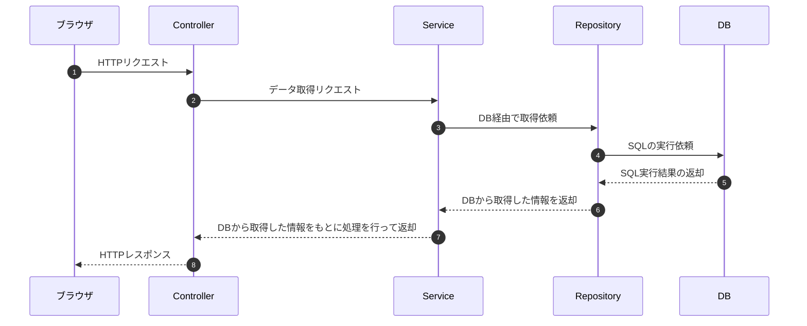

# RepositoryとEntity
Java基礎講座内で、ControllerとServiceに関するコードの切り分け方法について学びました。
Java応用講座ではDB関連について学んでいっていますが、このDB関連を記述する部分に関しても、SpringBoot内で標準的な方法があるので、ここで学んで置きましょう。

## Repositoryとは
Repositoryは、DBへの対するデータ操作をまとめたクラスです。リポジトリを使用することで、データベース操作のコードを簡潔にし、ビジネスロジック(Service)とデータアクセスロジック(Repository)を分離することができます。
使用するライブラリよって若干書き方は変わりますが、データにアクセスする部分は分けて書こう、という考え方はすべてのDB操作用のライブラリで一致しています。

今までもDBアクセス用に別途クラスを分けて記述していましたが、そのクラスに対してControllerやServiceのように、Repositoryという名前がついている、という認識で大丈夫です。



## `@Repository`アノテーション
Repository層のクラスに付与するアノテーションです。ControllerやServiceと同じく、これをつけることでDIコンテナで管理されるようになるので、例えばService内で@Autowiredを使っての自動インスタンス化が可能になります。
また、SQL関係のエラーが発生したときに、このアノテーションをつけている場合は管理しやすくなる、というメリットも実はあります。
以下は、SpringJDBCでのRepositoryのサンプルです。

```java
@Repository
public class UserRepository {

    @Autowired
    private JdbcTemplate jdbcTemplate;

    public List<User> getAllUsers() {
        // Spring JDBCを利用して取得
        String sql = "SELECT ID, NAME FROM NewEmployee";
        List<User> userList = jdbcTemplate.query(sql, new RowMapper<User>() {
            @Override
            public User mapRow(ResultSet rs, int rowNum) throws SQLException {
                User user = new User();
                user.setId(rs.getInt("ID"));
                user.setName(rs.getString("NAME"));
                return user;
            }
        });

        return userList;
    }
}
```

### 演習
- ユーザ一覧を取得するWEBアプリを、以下の層に分けて実装してみよう
  - Controller: ブラウザからのアクセスを受ける/ブラウザに返すデータをセットする
  - Service: Controllerに渡すためのデータを作るための具体的な処理を行う
  - Repository: Spring JDBCを使ってSQLを実行依頼しその結果を取得する

## Entityとは
Entityは、データベースのテーブルに対応させたJavaオブジェクトです。次のような特徴があります。

- データベースのテーブルに対応する
- フィールドはテーブルのカラムに対応する

これに関しても、今まで似たようなことをしていました。データを渡すために別のクラスを作成して、そのクラスに対してDBから取得したデータを格納していく、という流れです。
ただ特に、テーブルの構造とクラスの構造を一致させることで、より便利に扱うことができます。このテーブルと一致させたクラスのことをEntityと呼ぶ、という認識をしておけば大丈夫です。

### 例
次のようなテーブル定義がされている前提です。
```sql
CREATE TABLE users (
    id INT PRIMARY KEY AUTO_INCREMENT,
    name VARCHAR(100) NOT NULL,
    email VARCHAR(255) UNIQUE NOT NULL
);
```

このテーブルに対応するEntityとして、次のようなクラスを定義します。
```java
public class UserEntity {
    private int id;
    private String name;
    private String email;
}
```

このエンティティを使う場合、先ほどのRepositoryがもっと簡単に書けます。

```java
@Repository
public class UserRepository {

    @Autowired
    private JdbcTemplate jdbcTemplate;

    public List<User> getAllUsers() {
        // Spring JDBCを利用して取得
        String sql = "SELECT * FROM users";
        List<User> userList = jdbcTemplate.query(sql, new DataClassRowMapper<>(UserEntity.class));

        return userList;
    }
}
```

取得してきたデータのカラム名とエンティティのフィールド名が同じである場合、どのフィールドにどの要素を当てはめればいいか、JDBC側で認識して勝手に代入してくれるため、手動で当てはめる必要がありません。
より便利に扱うために、このような仕組みが備わっています。
