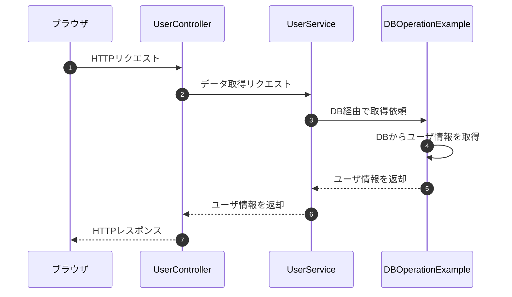

# SpringによるDBアクセス

## 前提：SpringもJava
SpringもJavaなので、今まで行ってきた方法でDBアクセスは可能です。いったん、前回とほとんど同じような記述で、データベースから取得したデータをブラウザに表示するWEBアプリを作成してみましょう。



流れとしてはこんな形です。一番左のDBOperationExampleはひとつ前の講義で作成したものをほとんどそのまま流用しています。この図には表していませんが、MyDriverManagerもそのまま使っていますので、DBの接続部分はまったく変わらずにSpringBootでもDBアクセスは可能です。

## より手軽な実装方法
先ほど確認したとおり、SpringでもJavaのみのときと同じようにJDBCを用いたDBアクセスが可能です。しかし、より手軽に実装できるようなSpring用のライブラリがいろいろ用意されています。
ここでは、3種類のライブラリを紹介します。

### ライブラリ共通の注意点
今まではコードの中で、DBの接続情報やユーザ認証情報を記述していましたが、コードのメンテナンス的にもセキュリティ的にも、あまりこれはいい書き方ではありません。
普通は、application.propertiesにこのあたりの設定を記述しておいて、SpringBoot側で自動的にその設定値を読み込む、という使い方をすることが多いです。
今回紹介するライブラリもすべてその形ですので、apprication.propertiesに以下の記述を追加しておきます。

```text
spring.datasource.url=jdbc:sqlserver://localhost:1433;databaseName=master;
spring.datasource.username=(ユーザ名)
spring.datasource.password=(パスワード)
spring.datasource.driver-class-name=com.microsoft.sqlserver.jdbc.SQLServerDriver
```

### Spring JDBC
今回紹介する中で、もっともシンプルなDB操作用のライブラリです。実際にコード内に直接SQLを記述していくため、基本的に今までの記述とあまり変わりませんが、

### Spring JPA
アノテーションベースでの記述を行うことによって、内部で自動的にSQLを記述してくれるライブラリです。

### MyBatis
MybatisもSpringBootでのDB操作のための
```java
@Mapper
public interface UserMapper {
    @Select("SELECT ID, NAME FROM User")
    List<User> findAll();
}
```

以上の3つを紹介しました。代表的によく使われるものはこの3つですが、それぞれメリット/デメリットがあり、そのときのプロジェクト特性などによって使い分けられます。
すべての書き方を覚えておく必要はありませんが、これらの単語を聞いたときに、Spring上でDB操作を行うためのライブラリなんだということ、それぞれどんな特徴があるのかは理解しておきましょう。

今後の研修としては、SQLの勉強も兼ねてSpring JDBCを使っていきます。