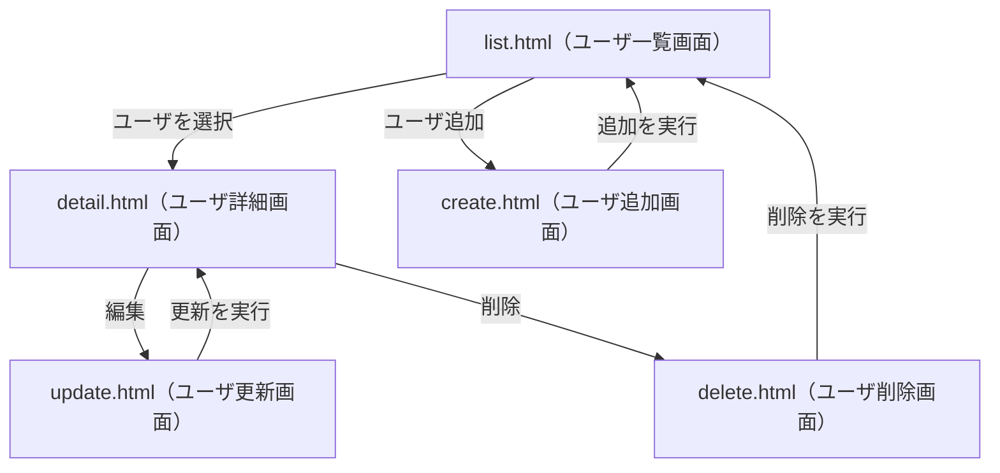
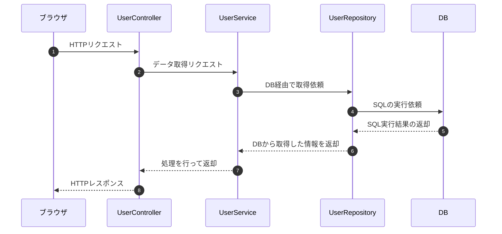

# 画面からのCRUD操作
ここまでで、基本的なDBの操作を含めたWEBアプリの構築が可能です。
この章では、実際にユーザの一覧を操作することができる実践的なアプリケーションを構築してみましょう。

## **CRUDとは？**
CRUD（**Create, Read, Update, Delete**）は、**データベースやシステムにおける基本的なデータ操作** を指します。  
アプリケーションのデータ管理の基本機能として、以下の4つの操作が含まれます。

| 操作 | 説明 | SQL の対応 |
|------|------|-----------|
| **Create**（作成） | 新しいデータを追加する | `INSERT` |
| **Read**（読み取り） | データを取得する | `SELECT` |
| **Update**（更新） | 既存のデータを変更する | `UPDATE` |
| **Delete**（削除） | データを削除する | `DELETE` |

## 今回構築するWEBアプリケーションの概要
CRUDの4操作を実際に行ってみるため、次のような画面を持つWEBアプリを作成してみます。

- ユーザ一覧画面（list.html）：最初のページ。ユーザを選択すると詳細に移る。
- ユーザ追加画面（create.html）：ユーザの追加画面。追加すると一覧に移る。
- ユーザ詳細画面（detail.html）：詳細のページ。更新や削除の操作ができる。
- ユーザ更新画面（update.html）：更新のページ。ユーザの情報を更新できる。更新した後は詳細ページに戻る。
- ユーザ削除画面（delete.html）：削除の確認ページ。削除した後は一覧ページに戻る。

画面遷移を図に表すと、次のような形です。


また、ここまで学んできたとおり、次のような構成でそれぞれクラスを設計します。
- UserController: URLなどを設定して、URLに応じてそれぞれ呼び出す関数を設定する。
- UserService: Repositoryの関数を呼び出して、Controllerにデータを渡す。
- UserRepository: 実際にDBにアクセスする。



## 実装してみよう
次のステップに分けて実装をしていきます。
1. ユーザ一覧を確認できるよう実装する。 
2. ユーザの追加ができるように実装する。
3. ユーザの詳細が確認できるように実装する。
3. ユーザの更新ができるように実装する。
4. ユーザの削除ができるように実装する。

配布したプロジェクトはそれぞれ枠組みだけ作成済みで、実装は空の状態になっているので、考えながら実装してみましょう！

### ユーザの一覧処理
まずはユーザの一覧処理を実装します。最初にhtmlを確認してみます。

```html
<table border="1">
    <tr>
        <th>ID</th>
        <th>名前</th>
        <th>Email</th>
        <th>操作</th>
    </tr>
    <tr th:each="user : ${userList}">
        <td th:text="${user.id}"></td>
        <td th:text="${user.name}"></td>
        <td th:text="${user.email}"></td>
        <td>
            <a th:href="@{/users/{id}(id=${user.id})}">詳細</a>
        </td>
    </tr>
</table>
```

ここからわかる通り、userListをHTMLに渡しているようです。それが叶うように、コントローラ→サービス→リポジトリの順で実装していきましょう。

- **コントローラの実装**
いったんコントローラで実装したい内容を言葉にすると、次のような形です。
1. サービスからユーザ一覧を取得
2. modelを用いてユーザ一覧をセット
3. list.htmlに遷移

具体的にユーザ一覧を取得する処理に関してはサービス層以下にお任せするので、コントローラに記述する内容はこれだけです。実際に記述してみましょう

### 記述例
```java
// ユーザ一覧
@GetMapping
public String listUsers(Model model) {
    List<UserEntity> userList = userService.getAllUsers();
    model.addAttribute("userList", userList);
    return "list";
}
```

※RequestMappingについて
今回はすべてURLが`/users`から始めるように設定しています。一つのコントローラに同じURLを設定する場合、いちいち設定するのが面倒なので、まとめて`@RequestMapping`を使って設定できます。

```java
@RequestMapping("/users")
public class UserController {

    // @GetMappingに何もパスを書かない場合、/usersでアクセスできるように
    @GetMapping
    public String listUsers(Model model) {
        ...
    }
}
```

- **サービスの実装**
サービスでのやりたいことは、以下の形です。
1. リポジトリからユーザ一覧を取得
2. 取得したユーザ一覧を返却

今回はDBから取得したデータを特別処理することなくそのまま渡すだけなので、サービスに記述する内容はめちゃくちゃ少ないです。やってみましょう。

### 記述例
```java
public List<UserEntity> getAllUsers() {
    return userRepository.findAll();
}
```

- **リポジトリの実装**
リポジトリでのやりたいことは、以下の形です。
1. sqlを実行命令
2. SQLの返却結果からエンティティを生成
3. 生成したエンティティを返却

Spring JDBCでエンティティの生成は楽に行うことが可能です。これも実装してみましょう。

### 記述例
```java
// 全ユーザ取得
public List<UserEntity> findAll() {
    String sql = "SELECT * FROM users";
    return jdbcTemplate.query(sql, userRowMapper);
}
```

- **動作確認**
ここまで完了すれば、ユーザ一覧が取得できるはず！実際に動作確認をしてみましょう。
`/users`にアクセスしてユーザ一覧が表示されていればOK！

### ユーザの追加処理
まったく同じ流れで実装していきます。htmlを確認しましょう。

```html
<form action="/users/create" method="post">
    <label>名前: <input type="text" name="name" required></label><br>
    <label>Email: <input type="email" name="email" required></label><br>
    <button type="submit">追加</button>
</form>
```

formで`/users/create`というURLに対してPOSTリクエストが送られるようです。
ここには`name`と`email`というパラメータが送られてきます。これを扱えるように実装していきましょう。

- **コントローラの実装**
まずはこのページにアクセスする部分から実装していきます。これは単にページを返却するだけなので、やってみましょう。

### 記述例
```java
// ユーザ追加画面
@GetMapping("/create")
public String createUserForm(Model model) {
    return "create";
}
```

次に、実際の登録情報がformから送られてきたときの処理を実装してみます。
1. `name`と`email`をformから受け取る
2. formから受け取ったデータをサービスに渡す。
3. 登録されたら、一覧画面に戻る。

ユーザの情報を作成したりその情報をDBに格納したりするのはすべてサービス層以下の仕事。あくまでコントローラは情報のやり取りをする部分だと意識して実装してみましょう。

### 記述例
```java
// ユーザ追加処理
@PostMapping("/create")
public String createUser(@RequestParam String name, @RequestParam String email) {
    userService.createUser(name, email);
    return "redirect:/users";
}
```

- **サービスの実装**
1. コントローラから渡されたデータをもとに、DBに保存したいUserEntityを作成
2. UserEntityをリポジトリに渡す

今回はコントローラから渡されたデータをもとに、UserEntityを作成するという処理をサービスに任せてみましょう。リポジトリ層はUserEntityを受け取ってDBの登録処理だけを担うように役割分担をします。

### 記述例
```java
public void createUser(String name, String email) {
    UserEntity user = new UserEntity();
    user.setName(name);
    user.setEmail(email);
    userRepository.save(user);
}
```

- **リポジトリの実装**
リポジトリでのやりたいことは、以下の形です。
1. サービスからUserEntityを受け取る
2. 受け取った情報をもとに、sqlを実行命令

Spring JDBCでエンティティの生成は楽に行うことが可能です。これも実装してみましょう。

### 記述例
```java
// ユーザ登録
public void save(UserEntity user) {
    String sql = "INSERT INTO users (name, email) VALUES (?, ?)";
    jdbcTemplate.update(sql, user.getName(), user.getEmail());
}
```

- **動作確認**
ここまで完了すれば、ユーザを追加できるはず！実際に動作確認をしてみましょう。
`/users/create`にアクセスしてユーザ情報を入力し、ユーザ一覧画面に戻って入力したユーザが登録されていることを確認しましょう。
DBのデータも確認してみて、ちゃんとDBにデータが格納されていることも確認しておきましょう。

### ユーザの詳細表示処理
ユーザの更新/削除に入る前に、それを行うためのユーザの詳細表示処理を実装しましょう。
基本的にはここまでの復習なので、自分で実装できそうな人は実装して理解を深めてみましょう。

```html
<h1>ユーザ詳細</h1>
<p>ID: <span th:text="${user.id}"></span></p>
<p>名前: <span th:text="${user.name}"></span></p>
<p>Email: <span th:text="${user.email}"></span></p>

<a th:href="@{/users/{id}/edit(id=${user.id})}">編集</a>
<a th:href="@{/users/{id}/delete(id=${user.id})}">削除</a>
<a href="/users">戻る</a>
```

HTMLファイルはこのような形で、ユーザ情報が渡されてそれが一覧で確認できること、また編集と削除ボタンが配置されています。

- **コントローラの実装**
これまでと違い、特定ユーザの情報にアクセスする必要があるので、idをパスから渡されるように実装してきましょう。
1. パスからID情報を受け取る
2. 受け取ったIDをサービスに渡し、ユーザ情報を受け取る
3. ユーザ情報をセットする
4. 詳細画面に遷移する

これを満たすように実装してみましょう。

### 記述例
```java
// ユーザ詳細
@GetMapping("/{id}")
public String userDetail(@PathVariable int id, Model model) {
    UserEntity user = userService.getUserById(id);
    model.addAttribute("user", user);
    return "detail";
}
```

- **サービスの実装**
1. コントローラから渡されたIDをリポジトリに渡す
2. リポジトリから取得したユーザ情報をコントローラに渡す

### 記述例
```java
public UserEntity getUserById(int id) {
    return userRepository.findById(id);
}
```

- **リポジトリの実装**
1. サービスからIDを受け取る
2. 受け取ったIDをもとに、sqlを実行命令
3. SQLの返却結果からエンティティを生成
4. 生成したエンティティを返却

一覧のときとやることはあまり変わりません。返却されるデータ数が複数でなく一つになるくらいです。返り値などに気を付けながら実装してみましょう。

### 記述例
```java
// IDでユーザ取得
public UserEntity findById(int id) {
    String sql = "SELECT * FROM users WHERE id = ?";
    UserEntity user = jdbcTemplate.queryForObject(sql, userRowMapper, id);
    return user;
}
```

- **動作確認**
`/users/list`にアクセスしてユーザ一覧から特定のユーザの詳細に遷移してみましょう。

### ユーザの更新処理(更新ページの表示)
更新処理は、大きく「更新用のページ表示処理」と「更新処理」の二つがあります。
まずは前者の実装から。同じくHTMLを確認してみましょう。

```html
<form th:action="@{/users/{id}/edit(id=${user.id})}" method="post">
    <label>名前: <input type="text" name="name" th:value="${user.name}" required></label><br>
    <label>Email: <input type="email" name="email" th:value="${user.email}" required></label><br>
    <button type="submit">更新</button>
</form>
```

いったんformの部分は置いておいて、inputの中にnameやemailがすでに格納されている状態にする必要があります。
これは更新するときに、今のユーザ情報を格納するためです。

- **コントローラの実装**
まずはこのページにアクセスする部分から実装していきます。ユーザ情報を取得してHTMLに今のユーザ情報を格納する必要がありますが、これまでやってきたことがわかれば実装できるはず。

### 記述例
```java
// ユーザ更新画面
@GetMapping("/{id}/edit")
public String updateUserForm(@PathVariable int id, Model model) {
    UserEntity user = userService.getUserById(id);
    model.addAttribute("user", user);
    return "update";
}
```

- **サービス/リポジトリの実装**
実はこの処理を行う場合は、追加でサービスやリポジトリに関数を追加する必要はありません。
なぜなら、詳細を表示するページにて「IDからユーザ情報を取得する」という処理はすでに実装済みです！
これが層を分けていることのメリットの一つでもあります（再利用可能）。

- **動作確認**
ユーザ詳細画面から更新リンクを選択して、今の登録情報がinput内に格納されていることを確認しましょう。

### ユーザの更新処理
ほとんど追加処理と同じような流れです。今一度HTMLを確認してみましょう。

```html
<form th:action="@{/users/{id}/edit(id=${user.id})}" method="post">
    <label>名前: <input type="text" name="name" th:value="${user.name}" required></label><br>
    <label>Email: <input type="email" name="email" th:value="${user.email}" required></label><br>
    <button type="submit">更新</button>
</form>
```

formで`/users/{id}/edit`というURLに対してPOSTリクエストが送られています。追加の場合と少し違うのは、IDもパラメータとして送信する必要がありそうです。
inputで送信しているのは追加と同じく`name`と`email`です。

- **コントローラの実装**
次に、実際の登録情報がformから送られてきたときの処理を実装してみます。
1. `id`をパスパラメータとして受け取る
2. `name`と`email`をformから受け取る
3. これらのパラメータをすべてサービスに渡す。
4. 登録されたら、詳細画面に戻る。

受け取るものが一つ増えただけで、やはりコントローラとしてはデータの受け渡しに集中してもらいます。

### 記述例
```java
// ユーザ更新処理
@PostMapping("/{id}/edit")
public String updateUser(@PathVariable int id, @RequestParam String name, @RequestParam String email) {
    userService.updateUser(id, name, email);
    return "redirect:/users/" + id;
}
```

- **サービスの実装**
こちらもIDが要素として増えただけで、追加処理と基本同じです。コントローラから渡されたデータをもとに、UserEntityを作成するという処理をサービスに任せてみましょう。リポジトリ層はUserEntityを受け取ってDBの登録処理だけを担うように役割分担をします。

### 記述例
```java
public void updateUser(int id, String name, String email) {
    UserEntity updatedUser = new UserEntity();
    updatedUser.setId(id);
    updatedUser.setName(name);
    updatedUser.setEmail(email);
    userRepository.update(updatedUser);
}
```

- **リポジトリの実装**
SQL文が少し変わるだけで、こちらも簡単に実装できます。やってみましょう。

### 記述例
```java
// ユーザ更新
public void update(UserEntity user) {
    String sql = "UPDATE users SET name = ?, email = ? WHERE id = ?";
    jdbcTemplate.update(sql, user.getName(), user.getEmail(), user.getId());
}
```

- **動作確認**
ここまで完了すれば、ユーザを更新できるはず！実際に動作確認をしてみましょう。
ユーザ更新画面からデータを入力し、詳細画面に遷移して更新された情報が格納されていることを確認しましょう。

### ユーザの削除処理
こちらもあまり難しく考えずに実装可能です。
「削除ページ表示処理」と「削除処理」の2つの処理を実装しますが、まとめて実装してみましょう。
削除ページのHTMLを見てみます。

```html
<p>本当に削除しますか？</p>
<p>ID: <span th:text="${user.id}"></span></p>
<p>名前: <span th:text="${user.name}"></span></p>
<p>Email: <span th:text="${user.email}"></span></p>

<form th:action="@{/users/{id}/delete(id=${user.id})}" method="post">
    <button type="submit">削除</button>
</form>
```

削除確認用に、ユーザの情報を表示しているようです。

- **コントローラの実装**
まずはユーザの削除ページを表示するための処理を書いてみます。
ただしこのページに必要なのは、ユーザの情報があればいいので、今まで書いてきた処理が使いまわせそうです。

### 記述例
```java
@GetMapping("/{id}/delete")
public String deleteUserForm(@PathVariable int id, Model model) {
    UserEntity user = userService.getUserById(id);
    model.addAttribute("user", user);
    return "delete";
}
```
この形で、getUserByIdを使いまわすと簡単に実装できますね。

次に、ユーザの削除処理を行うための部分を記述します。
ユーザの削除を行うために必要なのは、ユーザを特定するための情報、つまりIDがあれば十分です。
つまり、以下のような形の実装で実現できそうです。
1. パスパラメータとしてIDを取得
2. サービスにIDを渡す
3. ユーザ一覧画面に遷移

これをもとに実装してみましょう。
### 記述例
```java
// ユーザ削除処理
@PostMapping("/{id}/delete")
public String deleteUser(@PathVariable int id) {
    userService.deleteUser(id);
    return "redirect:/users";
}
```

- **サービスの実装**
IDをリポジトリに渡すだけの実装です。考えて実装してみましょう。

### 記述例
```java
public void deleteUser(int id) {
    userRepository.deleteById(id);
}
```

- **リポジトリの実装**
SQL文にDELETEを用いるだけで、こちらも簡単に実装できます。やってみましょう。
検索条件としては、サービスから渡されたIDを使います。

### 記述例
```java
// ユーザ削除
public void deleteById(int id) {
    String sql = "DELETE FROM users WHERE id = ?";
    jdbcTemplate.update(sql, id);
}
```

- **動作確認**
ここまで完了すれば、ユーザの削除も可能です！やってみましょう。
ユーザ詳細画面からユーザ削除画面に遷移し、削除ボタンを押して一覧から削除されることを確認しましょう。

---

ここまで実装できれば、DBの操作を含めたWEBアプリの基本的な構成は完璧です！
このプロジェクトを一から構成できるようになれば、基本的にはどんなアプリケーションも作成できます！
